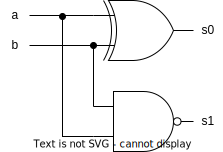

本章会介绍：

- 逻辑表达式和电路
- 布尔运算
- 逻辑门和简单电路的综合
- CAD 和 VerilogHDL
- 逻辑表达式的化简与卡诺图（Karnaugh maps)

## 逻辑表达式

考虑一个简单的开关电路

```goat
        x
        |
      .-+-.
  +---+ S +-----+
--+-- '-+-'   .-+-.
              | L |
 -+-          '-+-'
  +             |
  +-------------+
```

S 表示这是一个开关，x是外部的输入信号，L表示灯。当 x=0 时，L=0；x=1时，L=1. 所以我们可以写成：

$$
L(x)=x
$$

```goat
       x1      x2
        |      |
      .-+-.  .-+-.
  +---+ S +--+ S +---+
--+-- '-+-'  '-+-' .-+-.
                   | L |
 -+-               '-+-'
  +                  |
  +------------------+
```

只有当 $x_1,x_2$ 同时为 1 时，L 才等于 1. 上面的电路则可以写成：

$$
L(x_1,x_2)=x_1\cdot x_2
$$

符号 $\cdot$ 称为 **与（AND）**。

```goat
          x1
          |
        .-+-.
  +-----+ S +------+
--+--   '-+-'    .-+-.
          |      | L |
 -+-    .-+-.    '-+-'
  +     | S |      |
  |     '-+-'      |
  |       |        |
  |       x2       |
  +----------------+
```

当 $x_1$ 或 $x_2$ 为 1 时，L 为 1. 上面的电路可以写成：

$$
L(x_1,x_2)=x_1+x_2
$$

符号 $+$ 称为 **或（OR）**。

```goat
      .------.
  +---+      +----+
--+-- '------'    |
              +---+---+
 -+-        .-+-.   .-+-.
  +      x -+ S |   | L |
  |         '-+-'   '-+-'
  |           +---+---+
  |               |
  +---------------+
```

当 x=0 时，L 为 1. 上面的电路可以写成：

$$
L(x)=\overline{x}
$$

上划线表示 **非（NOT）**，有一些其他表示方法，比如：

$$
\overline{x}=x'=!x=\sim x={\rm NOT}\; x
$$

## 真值表

我们介绍了基本的逻辑表达式，并给出了它们的电路定义，下面我们将给出了它们的真值表：

|$x_1,x_2$ | $x_1\cdot x_2$ | $x_1+x_2$ |
|:--------:|:--------------:|:---------:|
| 0 0 | 0 | 0 |
| 0 1 | 0 | 1 |
| 1 0 | 0 | 1 |
| 1 1 | 1 | 1 |

真值表的最左边给出所有的输入组合，而右边则给出逻辑表达式的输出。真值表可以直观地展示出逻辑表达式。真值表会随着输入指数增长，比如当输入有 3 个，则真值表有 8 行。

|$x_1,x_2,x_3$ | $x_1\cdot x_2 \cdot x_3$ | $x_1+x_2+x_3$ |
|:--------:|:--------------:|:---------:|
| 0 0 0 | 0 | 0 |
| 0 0 1 | 0 | 1 |
| 0 1 0 | 0 | 1 |
| 0 1 1 | 0 | 1 |
| 1 0 0 | 0 | 1 |
| 1 0 1 | 0 | 1 |
| 1 1 0 | 0 | 1 |
| 1 1 1 | 1 | 1 |

与和或都可以接受多个输入，与只有在输入都为 1 时才为 1，而或在输入中有一个为 1 时就为 1.

## 逻辑门

逻辑表达式在电路中可以通过晶体管/MOS管来实现，这在电路中可以用逻辑门来表示：


通过组合逻辑门可以得到逻辑电路。

### 逻辑电路的分析

#### 例一

对于给定的逻辑电路，我们可以想象给定输入后得到什么输出，比如下面这个电路：$f=\overline{x}_1+x_1\cdot x_2$


其真值表为：

| $x_1, x_2$ | $A,B$ | $f(x_1,x_2)$ |
|:----:|:----:|:----:|
| 0 0 | 1 0 | 1 |
| 0 1 | 1 0 | 1 |
| 1 0 | 0 0 | 0 |
| 1 1 | 0 1 | 1 |

其时序图为：


时序图可以用于在实际电路中，通过逻辑分析仪，来观察其实际工作情况。

上面的逻辑表达式实际上等价于 $g=\overline{x}_1+x_2$，它们有相同的真值表。

#### 例二

考虑下面的逻辑电路：


|$x,y$ | L |
|:--------:|:--------------:|
| 0 0 | 0 |
| 0 1 | 1 |
| 1 0 | 1 |
| 1 1 | 0 |

只有当 x,y 不相同时，输出才为 1。我们把这个称为 **异或（XOR）**，记为 $x \oplus y$，用下面的逻辑门来表示：


对异或门取反可以得到 **同或（NAND）**，记为 $x \odot y$，用下面的逻辑门来表示：


#### 例三

在上一节我们介绍了二进制数，考虑两个一位的二进制数相加，则可能有四种结果；

$$
\begin{array}{r}
    a\\
   +b\\
   \hline
   s_1s_0
\end{array}
$$

|$a,b$ | $s_1s_0$|
|:---:|:----:|
|0 0|0 0|
|0 1|0 1|
|1 0|0 1|
|1 1|1 0|

注意到 $s_0=a\oplus b$，$s_1=a\odot b$，所以可以画出如下逻辑电路：



这个电路称为 **半加器**。

## 布尔代数

George Boole 在 1849 年发表了用代数描述逻辑推理的方法，被后人称为 Boolean Algebra.

### 公理

假设有如下公理：

1. $0\cdot 0=0$
2. $1+1=1$
3. $1\cdot 1=1$
4. $0+0=0$
5. $0\cdot 1=1\cdot 0=0$
6. $1+0=0+1=1$
7. If $x=0$, then $\overline{x}=1$
8. If $x=1$, then $\overline{x}=0$

### 定理

#### 单变量定理

1. $x\cdot 0=0$
2. $x+1=1$
3. $x\cdot 1=0$
4. $x+0=x$
5. $x\cdot x=x$
6. $x+x=x$
7. $x\cdot\overline{x}=0$
8. $x+\overline{x}=1$
9. $\overline{\overline{x}}=x$

以上定理很容易证明，只需要代入 0 或 1 即可。

#### 对偶

某个逻辑表达式的 **对偶式** 可以通过将 与/或 互换，0/1 互换来得到。观察上面的公理和定理，可以发现一些式子是对偶的。比如：

$$
x+0=x \leftrightarrow x\cdot 1=x
$$

如果一个逻辑表达式是正确的，其对偶式也是正确的，它们的结果是一样的。因此，一般有两种方法来表示同一个逻辑表达式，通常其中一种会更简单。

#### 多变量定理

交换率（Commutative）

- $x\cdot y = y\cdot x$
- $x+y=y+x$

结合率（Associative）

- $x\cdot(y\cdot z)=(x\cdot y)\cdot z$
- $x+(y+z)=(x+y)+z$

分配律（Distributive）

- $x\cdot(y+z)=x\cdot y+x\cdot z$
- $x+y\cdot z=(x+y)\cdot(x+z)$

吸收率（Absorption）

- $x+x\cdot y=x$
- $x\cdot(x+y)=x$
- $x\cdot y+x\cdot\overline{y}=x$
- $(x+y)\cdot(x+\overline{y})=x$

德·摩根定律（DeMorgan's theorem）

- $\overline{x\cdot y}=\overline{x}+\overline{y}$
- $\overline{x+y}=\overline{x}\cdot\overline{y}$
- $x+\overline{x}\cdot y=x+y$
- $x\cdot(\overline{x}+y)=x\cdot y$

共识定理（Consensus）

- $x\cdot y+y\cdot z+\overline{x}\cdot z=x\cdot y+\overline{x}\cdot z$
- $(x+y)\cdot(y+z)\cdot(\overline{x}+z)=(x+y)\cdot(\overline{x}+z)$

### 例子

证明以下逻辑表达式：

$$
(x_1+x_2)\cdot(\overline{x}+\overline{x}_2)=x_1\cdot\overline{x}_2+\overline{x}_1\cdot x_2
$$

展开等式左边：

$$
\begin{align}
    {\rm LHS} &= (x_1+x_2)\cdot\overline{x}_1+(x_1+x_2)\cdot\overline{x}_2\\
    &=x_1\cdot\overline{x}_1+x_2\cdot\overline{x}_1+x_1\cdot\overline{x}_2+x_2\cdot\overline{x}_2\\
    &=0+x_2\cdot\overline{x}_1+x_1\cdot\overline{x}_2+0\\
    &=x_2\cdot\overline{x}_1+x_1\cdot\overline{x}_2
\end{align}
$$

### 韦恩图

韦恩图也可以用于证明逻辑表达式的正确性。这里就不花了，有兴趣的话可以试着证明一下共识定理。

## 用与/或/非门综合

有了以上知识，我们可以尝试用与/或/非门得到所希望的逻辑功能。考虑下面的真值表：

| $x_1,x_2$ | $f(x_1,x_2)$ |
|:---------:|:------------:|
| 0 0 | 1 |
| 0 1 | 1 |
| 1 0 | 0 |
| 1 1 | 1 |

要写出逻辑表达式，我们可以将 $f=1$ 的行相加：

$$
f(x_1,x_2)=x_1x_2+\overline{x}_1x_2+\overline{x}_1\overline{x}_2
$$

> 注：以后我们写逻辑表达式时将省略 $\cdot$ 号。

但这样得到的式子并不是最简的。我们可以采取下面的化简方式：

$$
\begin{align}
    f(x_1,x_2) &= x_1x_2 + \overline{x}_1x_2+ \overline{x}_1x_2+\overline{x}_1\overline{x}_2\\
    &=(x_1+\overline{x}_1)x_2+\overline{x}_1(\overline{x}_2+x_2)\\
    &=x_2+\overline{x}_1
\end{align}
$$

直接用定理化简并不直观，所以后面我们会介绍另一种方法叫“卡诺图”。

### 积的和、和的积

下面我们将用专业术语来描述逻辑函数综合的过程。为了方便描述，我们将“与”看作乘，“或”看作除

#### 最小项

如果一个函数有 $n$ 个变量，则包含这 $n$ 个变量的乘积称为 **最小项（Minterm）**，变量可能是 $x_i$ 或 $\overline{x}_i$。真值表中的每一行都可以用一个最小项来表示。


