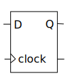

<iframe width="560" height="315" src="https://www.youtube.com/embed/vVYOV9MP5BA" title="YouTube video player" frameborder="0" allow="accelerometer; autoplay; clipboard-write; encrypted-media; gyroscope; picture-in-picture" allowfullscreen></iframe>

Verilog 是一种硬件描述语言，可以用来描述数字电路的行为。比如下面这个 Flip-Flop，在时钟的上升沿处，其输出 Q 会等于输入 D。用 Verilog 描述为：



```verilog
always@(posedge clock)
  Q<=D;
```

`always@()` 会在满足 `()` 里的条件时执行后面的代码块。

我们可以用这个来表示复杂的组合逻辑电路，如：


这是个选择器，当 a=1 时，foo=b xor c；否则 foo=b or c. 用 Verilog 描述为：

```verilog
/* 
  当 a/b/c 中有一个变化时，
  输出都会改变
*/
always@(a or b or c) 
  if (a) foo = b ^ c;
  else foo = b | c;
```

Verilog 提供了一种叫“连续赋值”（continuous assignment）的语法来简化描述组合逻辑电路：

```verilog
assign foo = a?b^c:b|c;
/* 三元运算符 ?: 和 C++ 是一样的 */
```

在上面的语句中，每当等号右边的量变化时，等号左边的量就会重新计算。

我们可以将这些组合成一个模块（module）

```verilog
module flipflop(clock,b,c,Q); /* 声明模块、模型与外界连接的端口 */
input clock,b,c; /* 定义端口方向和位数，这里都是1位 */
output Q; /* 定义端口端口方向和位数，这里都是1位 */
reg Q; /* 定义变量，reg 类型用于 always@ 语句*/
wire D; /* 定义变量，wire 类型用于 assign 语句 */
always@(posedge clock) /* 并行代码 */
  begin
    Q<=D;
  end
assign D=a?b^c:b|c; /* 并行代码 */
endmodule /* 模块结束 */
```

以上就是本文的全部内容，小结一下：我们介绍了三种Verilog写法：

- `always@(???edge clock)`：Flip-Flops and input logic
- `always@(*)`：根据行为建模的组合逻辑电路
- `assign a = ...` 根据结构建模的组合逻辑电路

以及模块的写法。Verilog 语法并不难，难的是设计。
